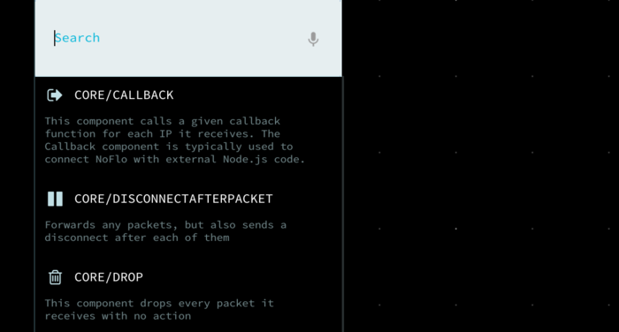
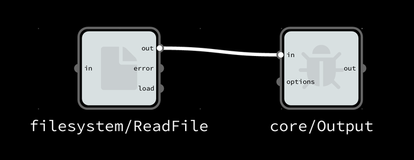
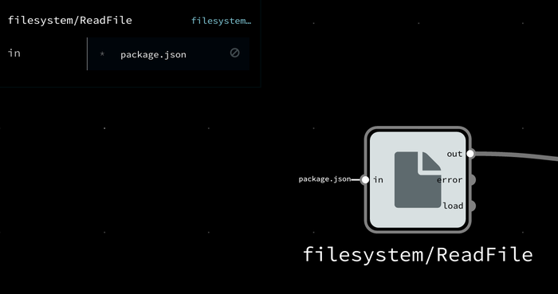
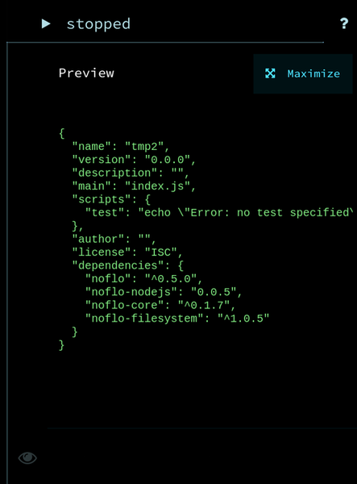

This guide assumes that you know the basic operation of the Flowhub app.
So if you haven't done so, it is a good idea to start with the
[browser getting started guide](http://flowhub.io/documentation/getting-started-browser/).

## Deploying a new runtime on Heroku

imgflo supports one-click deploy to Heroku from Flowhub. 
Heroku allows you to have up to 5 apps for free.
Registration & deployment process takes about 2 minutes.

Note: Free Heroku apps are shut down when idle.
So you might see that the runtime disconnects if not doing anything for a minute or two.
Clicking reconnect on the runtime should automatically start it again,
and you should be able to just continue using it as if nothing had changed.

## Alternative: installing a new runtime locally

imgflo currently supports GNU/Linux systems. In the future, Mac OSX and Windows
[might be supported](https://github.com/jonnor/imgflo/issues/3).
If you want to run it locally instead of on Heroku, you can follow the
[build and install instructions](https://github.com/jonnor/imgflo#developing-and-running-locally).

## Testing imgflo runtime in live mode

Open in browser `http://YOURAPP.herokuapps.com` (or `http://localhost:3569` if running locally)

Click on `Open in Flowhub`. This should now open the IDE and show the running graph.

If you now change a property, and open the right side panel you should see output data.

    TODO: picture how to run

Note: When in live mode, your graph changes are not stored.
See next section for how to get project persistance.

## Adding runtime for project mode use

Manual runtime configuration

Runtimes -> Add new runtime -> Add manually

Enter hostname to be `YOURAPP.herokuapps.com`

Runtime type should be `imgflo`

    TODO: picture

## Create new project

Projects -> Create, select type `Image Manipulation`

You can select your runtime in upper right corner `Select Runtime`.

## Your first graph

Now you should see that Flowhub is connected to your imgflo runtime,
and the library should show the available components.

    FIXME 

To make a simple server-side filesystem read operation, you can simply add two components:

* `gegl/load`
* `gegl/c2g`
* `gegl/crop`
* `Processor`

Now, connect the `out` port of the ReadFile node to the `in` port of the Output node:

    FIXME 

Then you need to tell the ReadFile node which file to read. Click the node and enter an IIP to the `in` port. We could for example read the local project's `package.json` file:

    FIXME 

If you now start the graph by clicking the "Play" button on the top-right corner, and then open the preview panel on the right you can see the output that normally would've been sent to `console.log` by Node.js:

    FIXME 

You can also see similar information by inspecting the connection itself:

    FIXME 

## Deploy graphs to web using imgflo-server

Using [imgflo-server](https://github.com/jonnor/imgflo-server) one can processing images using a HTTP API.
See [how to add graphs](https://github.com/jonnor/imgflo-server/blob/master/doc/adding-graphs.md)

