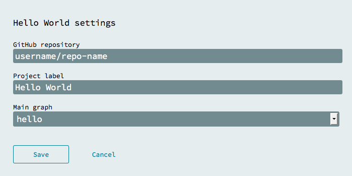
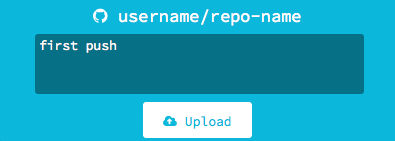

When you log into Flowhub we will perform authentication with GitHub that grants Flowhub access to push to your public repositories. For paid accounts, we also provide access to your [private GitHub repositories](https://github.com/pricing).

## Enabling private GitHub repositories

1. Log into [app.flowhub.io](http://app.flowhub.io/)
2. Click "Settings"
3. Click the refresh icon under "Flowhub plan"
4. Click "Login" (authorize on GitHub)
    

Once complete, your account will read, "Everything up to date" in your settings panel.

## Push project to GitHub

If you don't have any projects yet, try the [getting started guide](../getting-started-browser/).

1.  Open a project that you want to push
2.  Open the project panel by clicking the left side of the screen
3.  Tap "Settings"  
4.  Input your "github-username/repo-name" and save. If the repository doesn't exist it will be created for you on first push.
    
4.  Input project label and select your main graph from the dropdown
5.  You should now have an area to input a commit message and upload.  
    

## Import project from GitHub

On the Flowhub main page you can switch between "On device" (saved to browser memory) and "GitHub" (your Github projects).

1. Go to Github tab within Flowhub
	
2. Tap "Add" on the Add a repository card
	
3. Provide "github-username/repo-name" of the GitHub respoitory to import
4. Tap "Add"
    

If you're importing a project from an organization, provide "github-org-name/repo-name" instead of username.

